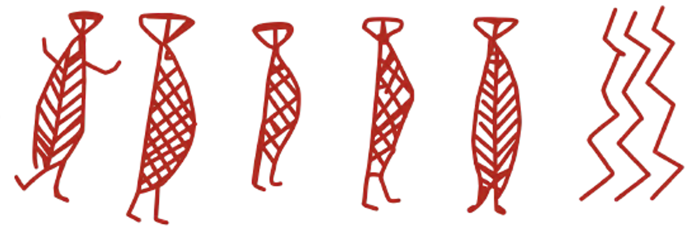

```{r global_options, include=FALSE}
knitr::opts_chunk$set(fig.pos = 'H')
```

<!-- THE INDEX IS IDEALLY DONE WITH https://www.tablesgenerator.com
An example of what the table is supposed to look like can be found in the Example.pdf within this folder.-->


\newpage

```{r logo, echo=FALSE, fig.align='center', fig.pos="H", out.width='100%'}

```

```{=tex}
\begin{center}
\Large\textbf{Editorial}
\end{center}
```
\noindent Greetings MM readers! \vspace{5mm}

\noindent Lorem ipsum dolor sit amet, consectetur adipiscing elit. Aenean ut elit odio. Donecfermentum tellus neque, vitae fringilla orci pretium vitae. Fusce maximus finibus facilisis. Donec ut ullamcorper turpis. Donec ut porta ipsum. Nullam cursus mauris a sapien ornare pulvinar. Aenean malesuada molestie erat quis mattis. Praesent scelerisque posuere faucibus.

\vspace{5mm}

\noindent Lorem ipsum dolor sit amet, consectetur adipiscing elit. Aenean ut elit odio. Donecfermentum tellus neque, vitae fringilla orci pretium vitae. Fusce maximus finibus facilisis. Donec ut ullamcorper turpis. Donec ut porta ipsum. Nullam cursus mauris a sapien ornare pulvinar. Aenean malesuada molestie erat quis mattis. Praesent scelerisque posuere faucibus.

\vspace{5mm}

\noindent Harry Robson on behalf of the editorial board.

\vspace{50mm}

\raggedleft\itshape
Editorial board: Rick Schulting, Mary Jackes, David Lubell, Chris Meiklejohn and Harry Robson\\
Book reviews: Aimée Little\\
Management team and social media: Harry Robson and Sophy Charlton\\
Design and production: Niklas Hausmann
